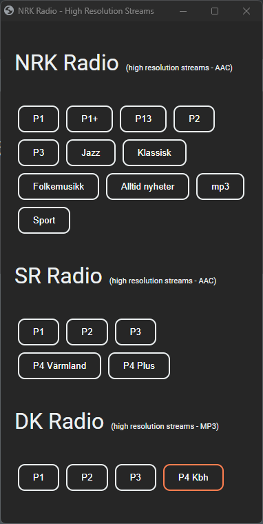

# Streaming Radio Player (as a static HTML page)

A static .html file for playing audio streams from selected radio stations.

Easily edit the list of stations by modifying the "streams" JSON in the "script" section of the HTML page.

Here is how it looks on my desktop:

## HOW TO: Create a desktop shurtcut to a minimal "web app"

Create a shortcut on your desktop to open the html page as a minimal "web app".

The static HTML file will open as a "minmal" web app on your local machine.

* Windows: [How to create a "web app" shortcut on your desktop](docs/how_to__create_a_desktop_shortcut_on_Windows.md)

* Mac: [How to create a "web app" shortcut on your desktop](docs/how_to__create_a_desktop_shortcut_on_Mac.md)

## HOW TO: Serve the web page from a web server

1. Copy the "radio_streams_player.html" file to your web server.
2. Edit the "streams" JSON in the "script" section of the HTML page to add your preferred radio stations / streams.
3. Open  <https://yourdomain/radio_streams_player.html> in your browser.

### Contribution guidelines

* Writing tests (TBD)
* Code review (TBD)
* Other guidelines (TBD)

### Who do I talk to?

* Repo owner or admin (TBD)
* Other community or team contact (TBD)

### Useful MarkDown resources

* [Learn Markdown](https://bitbucket.org/tutorials/markdowndemo)
