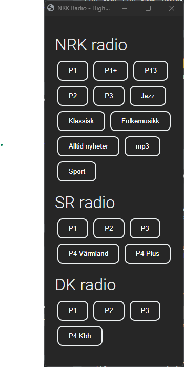

# Streaming Radio Player (as a static HTML page)

A static .html file for playing audio streams from selected radio stations.

Easily edit the list of stations by modifying the "streams" JSON in the "script" section of the HTML page.

## FEATURE REQUESTS

* [FEATURE: Electron app : Hide the "native" application menu](docs/FEATURE_Electron_app__Hide_native_application_menu.md)

* [FEATURE: HTML: Keep radio streams preferences in a local file](docs/FEATURE__HTML__Keep_radio_streams_preferences_in_a_local_filed.md)

* [FEATURE: HTML: Button to view the full source of the loaded page](docs/FEATURE__HTML__Button_to_view_the_full_source_of_the_loaded_page.md)

Here is how it looks on my desktop:



## Curated list of radio stations (streaming URLs)

* See [Curated list of radio stations](./docs/curated_list_of_radio_stations.md)

* See also [Related Radio Player prjects on GitHub](./docs/related_radio_player_projects.md)

## HOW TO: Play the radio streams on your local machine

1. Download "radio_streams_player.html" and save it to your local machine.
2. Open the "radio_streams_player.html" file in your preferred browser.
3. Click on the radio station you want to listen to.

## HOW TO: Add a new radio station / stream

1. Edit the "streams" JSON in the "script" section of the HTML page.

2. Add a new category of radio stations to the "streams" JSON

   * By adding a new JSON object to the "streams" JSON array:

    ```javascript
        {
            category: "SELF-1",
            categoryTitle: "My stations",
            streams: [
              { title: "P1", url: "http://lyd.nrk.no/nrk_radio_p1_ostlandssendingen_aac_h", type: "audio/aac" },
              { title: "Sport", url: "https://lyd.nrk.no/nrk_radio_sport_aac_h", type: "audio/aac" }
            ]
          },
    ```

3. Save the HTML page.

## HOW TO: Create a desktop shurtcut to a minimal "web app"

Create a shortcut on your desktop to open the html page as a minimal "web app".

The static HTML file will open as a "minmal" web app on your local machine.

* Windows: [How to create a "web app" shortcut on your desktop](docs/how_to__create_a_desktop_shortcut_on_Windows.md)

* Mac: [How to create a "web app" shortcut on your desktop](docs/how_to__create_a_desktop_shortcut_on_Mac.md)

## HOW TO: Build an "Electron app" from the HTML page

* See [HOW TO: Build an "Electron app" from the HTML page](build__electron_app_from_html_page/README.md)

## HOW TO: Serve the web page from a web server

1. Copy the "radio_streams_player.html" file to your web server.
2. Edit the "streams" JSON in the "script" section of the HTML page to add your preferred radio stations / streams.
3. Open  <https://yourdomain/radio_streams_player.html> in your browser.

## HOW TO: Scrape the loaded web page, to get the Javascript-generated HTML

* See [HOW TO: Scrape the loaded web page](build__scrape_loaded_html_page/README.md)

### Contribution guidelines

* Writing tests (TBD)
* Code review (TBD)
* Other guidelines (TBD)

### Who do I talk to?

* Repo owner or admin (TBD)
* Other community or team contact (TBD)

### Useful MarkDown resources

* [Learn Markdown](https://bitbucket.org/tutorials/markdowndemo)
